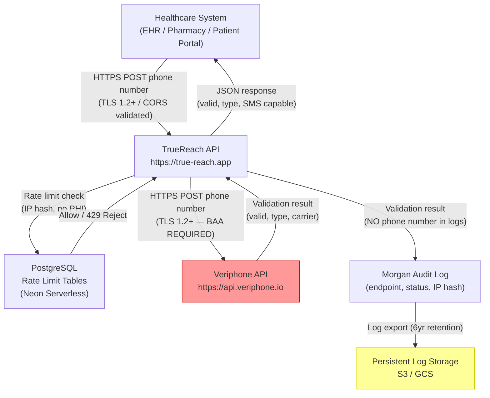

# TrueReach Phone Validation Widget
## HIPAA/HITRUST Compliance-First SRS/PRD

**Document Type:** Compliance-Enforced Security Requirements Specification  
**System:** TrueReach Phone Validation Widget (`https://true-reach.app`)  
**Version:** 1.0  
**Date:** March 27, 2026  
**Classification:** CONFIDENTIAL — Healthcare Compliance Document  
**Prepared By:** Security Architecture & Compliance Team  

---

> **COMPLIANCE ENFORCEMENT NOTICE**
> This document operates under PHI Maximum Protection Mode. All phone numbers processed by TrueReach are classified as PHI under 45 CFR 164.103 due to their potential linkage to patient identity. Functionality that conflicts with compliance requirements is **REJECTED**, not deferred.

---

## DOCUMENT CONTROL

| Item | Detail |
|---|---|
| System | TrueReach Phone Validation Widget |
| Production URL | https://true-reach.app |
| Stack | Express.js / React / TypeScript / PostgreSQL (Neon Serverless) |
| Hosting | Replit (prototype) → Cloud production |
| Integrations | EHR systems, Pharmacy Management Systems, Veriphone API |
| PHI Scope | Phone numbers (mandatory PHI classification) |
| Compliance Frameworks | HIPAA Security Rule (45 CFR 164), HITRUST CSF |

---

## SECTION 1 — REGULATORY CONTROL ENFORCEMENT

---

### 1A. HIPAA SECURITY RULE — DEEP MAPPING

---

#### 164.308 — ADMINISTRATIVE SAFEGUARDS

---

##### 164.308(a)(1) — Security Management Process

**WHAT:** Establish a formal security management process to prevent, detect, contain, and correct security violations related to PHI (phone numbers).

**WHY:** 45 CFR 164.308(a)(1)(i) — Required implementation specification. Covered entities and Business Associates must implement policies and procedures to prevent, detect, contain, and correct security violations.

**HOW:**
- Designate a Security Officer responsible for TrueReach compliance (can be combined with existing HIPAA Security Officer role)
- Maintain a written Information Security Policy covering phone number PHI
- Conduct quarterly security reviews of API logs, rate limit violations, and access patterns via Morgan request logs stored in PostgreSQL
- Define incident response SLA: detection within 1 hour, containment within 4 hours, notification within 60 days per 45 CFR 164.410

**FAILURE MODE:** Without a security management process, a breach of phone number data would have no detection mechanism, no containment procedure, and no path to breach notification — exposing the organization to OCR enforcement and civil monetary penalties up to $1.9M per violation category per year.

**EVIDENCE:**
- Written Information Security Policy document (dated, versioned, signed)
- Security Officer designation letter
- Quarterly security review meeting minutes
- Incident response runbook with timestamped drill records

---

##### 164.308(a)(1)(ii)(A) — Risk Analysis

**WHAT:** Conduct a thorough assessment of potential risks and vulnerabilities to the confidentiality, integrity, and availability of PHI (phone numbers) held by TrueReach.

**WHY:** 45 CFR 164.308(a)(1)(ii)(A) — Required implementation specification. Risk analysis is the foundation of all HIPAA Security Rule compliance.

**HOW:**
- Scope: All systems that receive, process, transmit, or temporarily hold phone numbers — includes the Express.js backend, PostgreSQL rate-limiting tables, Veriphone API integration, browser client, and embeddable widget JS
- Methodology: NIST SP 800-30 Rev 1
- Threat catalog must include: API injection, man-in-the-middle, rate limit bypass, third-party API data leakage, log scraping
- Assign likelihood (1-5) and impact (1-5) ratings
- Document residual risk after controls applied
- **CURRENT RISK FINDING:** Veriphone API receives phone numbers over HTTPS but does NOT have a BAA on file — see Section 7 for REJECTION NOTICE
- Re-assess after any material system change (new endpoint, new integration, new hosting)

**FAILURE MODE:** Without documented risk analysis, OCR has grounds for immediate enforcement action regardless of whether a breach occurred. Absence of risk analysis is the single most cited HIPAA violation in OCR audits.

**EVIDENCE:**
- Signed Risk Analysis document (NIST SP 800-30 format)
- Asset inventory listing all components that touch phone numbers
- Threat/vulnerability register with likelihood and impact scores
- Residual risk acceptance sign-off by Security Officer

---

##### 164.308(a)(1)(ii)(B) — Risk Management

**WHAT:** Implement security measures sufficient to reduce identified risks to a reasonable and appropriate level.

**WHY:** 45 CFR 164.308(a)(1)(ii)(B) — Required implementation specification.

**HOW:**
- Map each risk from Risk Analysis to a specific technical or administrative control
- Current implemented controls: Helmet.js security headers, CORS allowlist, RateLimiterPostgres (100 req/15min realtime, 10 req/min batch), Morgan structured logging, TLS 1.2+ via Replit/Cloudflare infrastructure
- Gaps requiring remediation (see Section 8): CSP disabled, no BAA with Veriphone, no encryption-at-rest for rate limit tables
- Maintain risk register with owner, due date, and remediation status
- Formal sign-off required for any risk accepted without remediation

**FAILURE MODE:** Unmanaged risks result in preventable breaches. PHI exposure through an unmitigated vulnerability is a reportable breach under 45 CFR 164.400.

**EVIDENCE:**
- Risk register (Excel or GRC tool) with control mapping
- Control implementation records (git commits, config files, deployment logs)
- Risk acceptance sign-off forms for accepted residual risks

---

##### 164.308(a)(2) — Assigned Security Responsibility

**WHAT:** Identify a single individual as the HIPAA Security Officer for TrueReach.

**WHY:** 45 CFR 164.308(a)(2) — Required implementation specification.

**HOW:**
- Document name and title of Security Officer
- Security Officer has authority to halt deployment if compliance requirements are not met
- Security Officer reviews all third-party integrations before go-live
- Security Officer receives all security event alerts from Morgan logging pipeline

**FAILURE MODE:** Without an assigned Security Officer, there is no accountable party for HIPAA compliance decisions — all workforce members become individually exposed.

**EVIDENCE:**
- Signed Security Officer designation letter
- Org chart showing Security Officer position
- Contact information in incident response runbook

---

##### 164.308(a)(3) — Workforce Security

**WHAT:** Implement policies to ensure workforce members have appropriate access to PHI and prevent unauthorized access.

**WHY:** 45 CFR 164.308(a)(3)(i) — Required implementation specification.

**HOW:**
- Developer access to TrueReach developer docs is controlled via two-factor authentication: Replit OAuth login + time-limited developer access code (stored as `DEV_DOCS_PASSWORD` environment secret, never in source code)
- Production database credentials are stored exclusively in Replit environment secrets (`DATABASE_URL`) — never in `.env` files committed to version control
- Access to production Replit deployment is restricted to named engineers with verified Replit accounts
- Offboarding procedure: rotate `SESSION_SECRET`, `DEV_DOCS_PASSWORD`, and `VERIPHONE_API_KEY` within 24 hours of workforce member departure

**FAILURE MODE:** Unauthorized access by former employees or over-privileged current employees is a reportable breach if phone number PHI is accessed.

**EVIDENCE:**
- Access control list for Replit team members
- Secret rotation logs (timestamped)
- Offboarding checklist with Security Officer sign-off

---

##### 164.308(a)(4) — Information Access Management

**WHAT:** Implement policies for authorizing access to PHI, granting access only to the minimum necessary.

**WHY:** 45 CFR 164.308(a)(4)(i) — Required implementation specification.

**HOW:**
- Developer docs: Requires Replit OAuth AND developer access code — two independent factors
- Batch validation API (`/api/validate`): Rate limited to 10 uploads/minute per IP; no persistent storage of validated results
- Realtime validation API (`/api/validate-realtime`): Rate limited to 100 req/15min; open CORS for widget use case — **see PARTIAL COVERAGE flag in 1C**
- PostgreSQL: Rate limit tables (`rate_limit_api`, `rate_limit_strict`) contain hashed IP addresses only — no phone numbers stored
- Veriphone API key: Stored in `VERIPHONE_API_KEY` environment secret; never exposed to client-side code

**FAILURE MODE:** Over-permissioned access allows insider threats or compromised accounts to access PHI beyond their role.

**EVIDENCE:**
- Replit team member access list
- Rate limit configuration code (`server/routes.ts`)
- Environment secret audit log (Replit admin panel)
- Database schema showing no PHI columns in stored tables

---

##### 164.308(a)(5) — Security Awareness & Training

**WHAT:** Implement security awareness and training for all workforce members who handle PHI.

**WHY:** 45 CFR 164.308(a)(5)(i) — Required implementation specification.

**HOW:**
- Annual HIPAA Security Rule training for all engineers with access to TrueReach codebase
- Training must cover: PHI classification of phone numbers, secure coding practices (no logging of phone numbers), secret management via environment variables, incident reporting procedures
- Training completion tracked in HR system with certificate retention for 6 years per 45 CFR 164.530(j)
- Code review checklist item: "Does this change log any phone number data?" — must be signed off by Security Officer for any logging change

**FAILURE MODE:** Untrained workforce members may inadvertently log phone numbers, hardcode secrets, or misconfigure security controls — creating PHI exposure.

**EVIDENCE:**
- Training completion certificates (name, date, score)
- Code review checklist records
- HR training log with 6-year retention

---

##### 164.308(a)(6) — Security Incident Procedures

**WHAT:** Implement policies and procedures to address security incidents.

**WHY:** 45 CFR 164.308(a)(6)(i) — Required implementation specification.

**HOW:**
- Detection: Morgan request logging captures all API calls with timestamp, IP (anonymized via `getClientIp()`), endpoint, and HTTP status code — NO phone numbers logged
- Alerting: Configure log aggregation to alert on: sustained 429 responses (brute force indicator), unexpected 500 errors on validation endpoints, unusual geographic IP patterns
- Incident classification:
  - Tier 1 (PHI Breach): Phone number accessed by unauthorized party → 60-day breach notification per 45 CFR 164.410
  - Tier 2 (Security Event): Unauthorized access attempt blocked → log and review
  - Tier 3 (System Anomaly): Elevated error rates, service degradation → operational response
- Post-incident: document root cause, remediation, and control improvement within 30 days

**FAILURE MODE:** Without incident detection and response, breaches go undetected past the 60-day notification window, triggering mandatory penalty escalation.

**EVIDENCE:**
- Morgan log files (retained minimum 6 years)
- Incident response runbook (versioned)
- Incident report records (if any events occurred)
- Post-incident review documents

---

##### 164.308(a)(7) — Contingency Plan

**WHAT:** Establish policies to respond to emergency or disaster that damages systems containing PHI.

**WHY:** 45 CFR 164.308(a)(7)(i) — Required implementation specification.

**HOW:**
- **Data Backup:** TrueReach operates statelessly — no phone number PHI is stored in the database. Rate limit tables (PostgreSQL/Neon) contain only IP hashes and counters. Neon serverless PostgreSQL provides automated point-in-time recovery (PITR) for up to 7 days
- **Disaster Recovery:** If Replit production deployment fails, re-deploy from source repository within 4 hours RTO. No PHI data loss risk because no PHI is persisted
- **Emergency Mode:** If Veriphone API is unavailable, system should return a "service temporarily unavailable" response rather than failing open or caching previous results
- Document RTO (4 hours) and RPO (0 hours — stateless) in writing

**FAILURE MODE:** Without a contingency plan, system downtime could cause emergency procedures that bypass security controls (e.g., temporarily disabling rate limiting), creating PHI exposure windows.

**EVIDENCE:**
- Contingency plan document (RTO/RPO documented)
- Neon PITR configuration screenshot
- Deployment runbook with recovery steps

---

##### 164.308(a)(8) — Evaluation

**WHAT:** Perform periodic technical and non-technical evaluations of security controls in response to environmental or operational changes.

**WHY:** 45 CFR 164.308(a)(8) — Required implementation specification.

**HOW:**
- Annual security evaluation of all controls mapped in this document
- Triggered evaluation required on: new third-party integration, new data flow, significant code change to validation endpoints, change in hosting provider
- Evaluation must include: penetration test of API endpoints, review of rate limit effectiveness, review of CORS configuration, review of secret management practices
- Track findings in risk register; close within 90 days or document accepted residual risk

**EVIDENCE:**
- Annual evaluation report (signed by Security Officer)
- Penetration test reports
- Change management log showing evaluation triggers

---

#### 164.310 — PHYSICAL SAFEGUARDS

---

##### Physical Safeguard Applicability Statement

**REPLIT (Prototype Environment):**
- TrueReach has **LIMITED CONTROL** over physical safeguards in the Replit environment
- Replit is hosted on Google Cloud Platform (GCP) infrastructure
- Physical security of servers, data centers, and hardware is entirely within Google's SOC 2 Type II and ISO 27001 certified infrastructure
- **RISK:** Replit itself is NOT a HIPAA Business Associate and does NOT offer BAAs for standard accounts
- **COMPENSATING CONTROL REQUIRED:** Replit must be used for development/prototype only. Production PHI-handling workloads must migrate to a HIPAA-eligible cloud provider (AWS, GCP, Azure) with executed BAA

**CLOUD PRODUCTION (Required for PHI Workloads):**

| Control | Requirement | Implementation |
|---|---|---|
| Facility Access Controls | 164.310(a)(1) | Select cloud provider with SOC 2 Type II + HIPAA BAA (AWS, GCP with Healthcare API, Azure) |
| Workstation Use | 164.310(b) | Engineers access production only from managed devices with full-disk encryption (AES-256) |
| Workstation Security | 164.310(c) | MDM-enrolled devices; screen lock after 5 minutes; remote wipe capability |
| Device & Media Controls | 164.310(d)(1) | No local storage of PHI; all development uses synthetic/anonymized test numbers |

**HOSTING RISK EXPLANATION:**
The current Replit deployment at `https://true-reach.app` processes real phone numbers from healthcare clients. This creates a physical safeguard compliance gap because Replit's standard Terms of Service do not include a HIPAA BAA. This is flagged as a **COMPLIANCE RISK** requiring remediation before handling live patient phone numbers at scale. See Section 8 for full gap analysis.

**EVIDENCE:**
- Cloud provider BAA (executed copy)
- Data center SOC 2 Type II report
- MDM enrollment records for engineer devices
- Development environment data classification policy (synthetic data only)

---

#### 164.312 — TECHNICAL SAFEGUARDS

---

##### 164.312(a) — Access Control

**WHAT:** Implement technical policies and procedures for electronic information systems to allow access only to authorized users.

**WHY:** 45 CFR 164.312(a)(1) — Required implementation specification.

**HOW — Current Implementation:**
```
Access Layers:
1. Developer Docs → Replit OAuth (OpenID Connect) + DEV_DOCS_PASSWORD secret
2. API Endpoints → Rate limiting per IP (RateLimiterPostgres)
3. Veriphone API → VERIPHONE_API_KEY (stored in environment secret, server-side only)
4. Database → DATABASE_URL (environment secret, never client-exposed)
5. Session Management → SESSION_SECRET (environment secret, connect-pg-simple)
```

**Unique User Identification (164.312(a)(2)(i) — Required):**
- Developer doc users: identified by Replit user ID (OAuth sub claim)
- API users: identified by client IP (via `getClientIp()` reading first X-Forwarded-For IP)
- **GAP:** Widget API (`/api/validate-realtime`) has open CORS (`Access-Control-Allow-Origin: *`) — any origin can call it. No user-level identification. See 1C flag.

**Automatic Logoff (164.312(a)(2)(iii) — Addressable):**
- Session expiry for developer docs: controlled by `connect-pg-simple` session store; configure `maxAge` to 8 hours maximum
- Widget API sessions: stateless — no session to expire

**Encryption & Decryption (164.312(a)(2)(iv) — Addressable):**
- All API keys and database credentials encrypted at rest by Replit's secret management infrastructure
- Transport encryption: TLS 1.2+ enforced by Replit/Cloudflare CDN
- **GAP:** Explicit TLS version enforcement not configured in Express.js — relying entirely on Replit/Cloudflare infrastructure; verify minimum TLS 1.2 in production

**EVIDENCE:**
- Environment secret configuration (Replit admin panel — no values, just existence)
- Session configuration code showing maxAge setting
- TLS certificate details (via `openssl s_client -connect true-reach.app:443`)
- CORS configuration code in `server/routes.ts`

---

##### 164.312(b) — Audit Controls

**WHAT:** Implement hardware, software, and/or procedural mechanisms to record and examine activity in systems containing PHI.

**WHY:** 45 CFR 164.312(b) — Required implementation specification.

**HOW — Current Implementation:**
```javascript
// Morgan logging (server/index.ts)
// Format: combined in production, dev in development
app.use(morgan(process.env.NODE_ENV === 'production' ? 'combined' : 'dev'));

// Combined format captures:
// :remote-addr - :remote-user [:date[clf]] ":method :url HTTP/:http-version" 
// :status :res[content-length] ":referrer" ":user-agent"
```

**CRITICAL REQUIREMENT — NO PHI IN LOGS:**
- Morgan's `combined` format does NOT log request body — phone numbers in POST body are NOT logged
- URL logging captures endpoint path only (`/api/validate-realtime`) — no query parameters containing phone numbers
- **ENFORCEMENT:** Code review must reject any `console.log(phone)` or `logger.info(phoneNumber)` patterns in production code

**Required Audit Log Schema:**
```json
{
  "timestamp": "2026-03-27T14:23:01.000Z",
  "method": "POST",
  "endpoint": "/api/validate-realtime",
  "status": 200,
  "client_ip_hash": "sha256(getClientIp(req))",
  "response_time_ms": 142,
  "user_agent": "Mozilla/5.0...",
  "rate_limit_remaining": 87
}
```

**PHI SCRUBBING RULE:** The `client_ip_hash` field in audit logs must use a keyed HMAC-SHA256 of the raw IP (key stored in environment secret) so IP addresses are pseudonymized in logs but still usable for rate limit correlation.

**Log Retention:** Minimum 6 years per 45 CFR 164.530(j). Configure log export to persistent storage (AWS S3 with versioning, or GCP Cloud Storage) before logs rotate.

**EVIDENCE:**
- Morgan configuration code
- Log samples showing no PHI in output
- Log retention policy document
- Log storage configuration (S3 bucket policy or equivalent)

---

##### 164.312(c) — Integrity Controls

**WHAT:** Implement policies to protect PHI from improper alteration or destruction.

**WHY:** 45 CFR 164.312(c)(1) — Required implementation specification.

**HOW:**
- **In-Transit Integrity:** TLS 1.2+ provides both encryption and integrity (MAC/AEAD) — tampering with phone numbers in transit is cryptographically detectable
- **API Integrity:** Express.js body parsing with `express.json()` validates JSON structure before processing; Zod schemas validate request shape
- **Database Integrity:** PostgreSQL ACID guarantees for rate limit tables; Neon serverless provides checksummed storage
- **Veriphone API Response Integrity:** Responses received over TLS — integrity protected in transit; implement response schema validation to detect unexpected/malformed responses
- **Code Integrity:** Deploy from version-controlled source (git with signed commits recommended); no ad-hoc production modifications

**Mechanism for Authenticating ePHI (164.312(c)(2) — Addressable):**
- Phone numbers are transient in TrueReach — not stored, therefore persistent integrity verification (hashing stored records) is not applicable
- For in-flight requests: TLS AEAD cipher suites provide integrity
- For audit logs: implement append-only log storage (S3 with MFA Delete, or CloudTrail equivalent)

**EVIDENCE:**
- TLS configuration showing cipher suites that include AEAD (AES-GCM preferred)
- Zod schema definitions in codebase
- Git commit signing configuration (`.gitconfig`)
- S3/log storage immutability configuration

---

##### 164.312(d) — Authentication

**WHAT:** Implement procedures to verify that a person seeking access to PHI is who they claim to be.

**WHY:** 45 CFR 164.312(d) — Required implementation specification.

**HOW — Current Implementation:**

| Access Point | Authentication Method | Strength |
|---|---|---|
| Developer Docs | Replit OAuth (OpenID Connect) + DEV_DOCS_PASSWORD | Two-factor (possession + knowledge) |
| API Endpoints | IP-based rate limiting only | Weak — no user identity verification |
| Veriphone API | API key in server-side environment secret | Adequate for server-to-server |
| Database | DATABASE_URL in environment secret | Adequate |

**GAP — Widget API Authentication:**
The `/api/validate-realtime` endpoint is publicly accessible with open CORS and no user authentication. While this is architecturally required for the embeddable widget use case, it means phone numbers submitted to this endpoint cannot be attributed to an authenticated user. For healthcare client deployments, consider:
1. Issuing client-specific API tokens (Bearer token in Authorization header)
2. Validating tokens server-side before processing phone numbers
3. This enables per-client audit trails and the ability to revoke access

**EVIDENCE:**
- OAuth configuration code
- Session management configuration
- API key rotation procedure document
- (Future) API token issuance and validation implementation

---

##### 164.312(e) — Transmission Security

**WHAT:** Implement technical security measures to guard against unauthorized access to PHI transmitted over electronic networks.

**WHY:** 45 CFR 164.312(e)(1) — Required implementation specification.

**HOW — Current Implementation:**
- **TLS:** Replit/Cloudflare enforces HTTPS for all traffic to `true-reach.app`. HTTP requests are redirected to HTTPS.
- **HSTS:** Configured via Helmet.js: `Strict-Transport-Security: max-age=63072000; includeSubDomains` — browsers will refuse HTTP connections for 2 years after first visit
- **Cipher Suites:** Cloudflare CDN default configuration supports TLS 1.2 and TLS 1.3; TLS 1.0 and 1.1 are disabled by Cloudflare default policy
- **Widget HTTPS Enforcement:** Widget script loaded from `https://true-reach.app/phone-validator-widget.js` — all API calls from widget use HTTPS endpoint

**Encryption in Transit (164.312(e)(2)(ii) — Addressable):**
- AES-256-GCM cipher suite (via TLS 1.3) for all API communications
- Veriphone API called server-side over HTTPS: `https://api.veriphone.io/v2/verify`
- Phone numbers NEVER transmitted over HTTP; HSTS prevents protocol downgrade

**GAP — TLS Version Verification:**
While Cloudflare enforces TLS 1.2+, the Express.js server itself does not explicitly configure minimum TLS version. This is acceptable ONLY while Cloudflare is the termination point. If direct Express.js HTTPS is ever configured, add: `tls: { minVersion: 'TLSv1.2' }`.

**EVIDENCE:**
- SSL Labs test report for `true-reach.app` (A or A+ rating expected)
- Helmet.js HSTS configuration code
- Cloudflare TLS settings screenshot (minimum TLS version)
- Network capture showing TLS 1.2+ handshake (no plaintext)

---

### 1B. HITRUST CSF — CONTROL MAPPING

---

| Domain | Control Objective | Example Control IDs | TrueReach Implementation | Maturity Level | Evidence Required |
|---|---|---|---|---|---|
| Access Control | Restrict system access to authorized users only | 01.a, 01.b | Replit OAuth + DEV_DOCS_PASSWORD for dev portal; rate limiting for API | Level 2 (Managed) | Access list, auth code, session config |
| Audit Logging & Monitoring | Record and review all access to PHI systems | 09.aa, 09.ab | Morgan combined logging; no PHI in logs enforced | Level 2 (Managed) | Log samples, retention policy |
| Information Classification | Classify all data; apply controls based on sensitivity | 07.a | Phone numbers classified as PHI; no persistent storage | Level 2 (Managed) | Data classification policy |
| Encryption — In Transit | Protect PHI during network transmission | 10.f | TLS 1.2+ via Cloudflare/Replit; HSTS enforced | Level 3 (Defined) | SSL Labs report, HSTS config |
| Encryption — At Rest | Protect stored PHI using encryption | 10.g | No PHI stored at rest; rate limit tables contain IP hashes only | Level 2 (Managed) | DB schema, no-PHI declaration |
| Third-Party Security | Manage security risks from third-party vendors | 06.e, 06.f | Veriphone API receives PHI — BAA NOT YET EXECUTED — CONTROL GAP | Level 1 (Performed) | BAA document (MISSING) |
| Incident Management | Detect, report, and respond to security incidents | 11.a, 11.b | Morgan logging; rate limit violation detection; incident runbook required | Level 1 (Performed) | Incident runbook, response records |
| Risk Management | Identify and treat information security risks | 03.a | Risk analysis per NIST SP 800-30 required; partially implemented | Level 1 (Performed) | Risk analysis document (MISSING) |
| Transmission Integrity | Protect PHI integrity during transmission | 10.h | TLS AEAD cipher suites; Zod schema validation | Level 2 (Managed) | TLS config, schema code |
| Vulnerability Management | Identify and remediate system vulnerabilities | 10.m | UNKNOWN — no automated dependency scanning configured | Level 0 (Incomplete) | Dependency scan tool, scan reports |
| Configuration Management | Maintain secure system configurations | 09.ba | Helmet.js hardening; CORS allowlist; rate limiting config | Level 2 (Managed) | Helmet config, CORS config code |
| Backup & Recovery | Ensure availability of PHI systems | 12.c | Stateless system; Neon PITR; deployment runbook | Level 2 (Managed) | Backup config, recovery runbook |
| Workforce Security | Manage workforce access to PHI | 07.b | Two-layer auth for developer access; secret rotation procedure | Level 2 (Managed) | Access list, rotation procedure |
| Privacy — Minimum Necessary | Limit PHI access to minimum needed | UNKNOWN | API returns only validation result; no PHI in response beyond formatted number | Level 2 (Managed) | API response schema |

---

### 1C. CONTROL COVERAGE VALIDATION

---

**CONTROL GAPS:**

| # | Gap | HIPAA Clause | Severity | Remediation |
|---|---|---|---|---|
| CG-01 | No BAA with Veriphone API — phone numbers transmitted to third party without Business Associate Agreement | 164.308(b)(1) | CRITICAL | Execute BAA with Idomoo Ltd (Veriphone operator) OR route validation through HIPAA-BAA-covered API alternative |
| CG-02 | Replit hosting has no HIPAA BAA — production PHI workload on non-BAA platform | 164.308(b)(1) | CRITICAL | Migrate production to AWS/GCP/Azure with executed BAA, OR obtain Replit Teams BAA if available |
| CG-03 | No formal Risk Analysis document per NIST SP 800-30 | 164.308(a)(1)(ii)(A) | HIGH | Conduct and document risk analysis before next production deployment |
| CG-04 | No automated dependency vulnerability scanning | 164.308(a)(1) | HIGH | Integrate `npm audit` into CI/CD pipeline; configure Dependabot or Snyk |
| CG-05 | Widget API open CORS with no user authentication — phone numbers submitted anonymously | 164.312(a)(2)(i) | MEDIUM | Implement API token authentication for healthcare client deployments |
| CG-06 | CSP disabled (Helmet.js `contentSecurityPolicy: false`) — allows inline scripts, XSS risk | 164.312(c) | MEDIUM | Configure restrictive CSP compatible with Vite build; use nonce-based CSP |
| CG-07 | Log retention not configured — Morgan logs not exported to persistent storage | 164.312(b) | HIGH | Configure log export to S3/GCS with 6-year retention |
| CG-08 | No IP pseudonymization in audit logs — raw IP addresses may be logged | 164.312(b) | MEDIUM | Implement HMAC-SHA256 IP hashing before logging |

**PARTIAL COVERAGE:**

| # | Area | Status | Note |
|---|---|---|---|
| PC-01 | Incident Response | Partial | Morgan logging present; formal incident runbook not documented |
| PC-02 | Workforce Training | Partial | Security awareness training not formally documented or tracked |
| PC-03 | Physical Safeguards | Partial | Covered by Replit/GCP infrastructure but no BAA; compensating controls needed |
| PC-04 | Contingency Plan | Partial | Stateless design reduces risk; formal RTO/RPO documentation missing |
| PC-05 | TLS Version Enforcement | Partial | Cloudflare enforces TLS 1.2+; Express.js itself does not configure minimum version |

---

## SECTION 2 — DATA GOVERNANCE & FLOW

---

### Data Classification

| Data Element | Classification | PHI Status | Rationale |
|---|---|---|---|
| Phone number (raw input) | PHI — HIGH | YES | Can identify patient when combined with context; 45 CFR 164.514(b) |
| Formatted phone number (response) | PHI — HIGH | YES | Derived from raw input; same sensitivity |
| Client IP address | Sensitive | CONDITIONAL | Not PHI alone; PHI when correlated with validation timestamp and phone number |
| Validation result (valid/invalid) | Internal | NO | Boolean result without phone number is not PHI |
| Carrier information | Internal | NO | Carrier name alone cannot identify a patient |
| Rate limit counters (PostgreSQL) | Operational | NO | Contains IP hashes and request counts only |
| Morgan access logs | Audit | CONDITIONAL | Must NOT contain phone numbers; IP addresses pseudonymized |
| Veriphone API key | Secret | NO | Credential, not PHI |

---

### PHI Data Lifecycle

| Phase | Requirement | TrueReach Implementation | Status |
|---|---|---|---|
| Collection | Input validation; no PHI in URL parameters | Phone number received in POST body JSON only; never in URL/query string | COMPLIANT |
| Processing | No plaintext exposure in logs or intermediate storage | Express.js processes in memory only; Morgan logs endpoint path, not body | COMPLIANT |
| Transmission (client→server) | TLS 1.2+ required | HTTPS enforced via Cloudflare/Replit; HSTS configured | COMPLIANT |
| Transmission (server→Veriphone) | TLS 1.2+; BAA required | HTTPS to api.veriphone.io — TLS compliant; BAA NOT EXECUTED | PARTIAL |
| Storage | Encrypted at rest; no PHI in database | No phone numbers stored; rate limit tables contain only IP hashes | COMPLIANT |
| Retention | Maximum necessary retention only | Phone numbers: zero retention (stateless processing) | COMPLIANT |
| Deletion | Verifiable deletion; not applicable for non-stored data | Phone numbers never persisted; deletion proof = no storage schema | COMPLIANT |
| Disposal | Secure disposal for any temporary PHI | In-memory only; garbage collected after request completion | COMPLIANT |

---

### Data Flow Diagram



**Red = PHI data flow requiring BAA | Yellow = Control gap requiring remediation**

---

## SECTION 3 — SECURITY ARCHITECTURE (ZERO TRUST ENFORCED)

---

### Zero Trust Principles Applied

| Principle | Implementation | Status |
|---|---|---|
| Never trust, always verify | Every API request validated against rate limiter; developer portal requires OAuth + access code | PARTIAL — widget API unauthenticated |
| Least privilege access | API keys server-side only; DB credentials in secrets; separate rate limit tables | COMPLIANT |
| Assume breach | Morgan logging for post-breach audit trail; stateless design limits blast radius | COMPLIANT |
| Verify explicitly | Authentication required for developer docs; IP verification for rate limiting | PARTIAL — widget API unauthenticated |
| Microsegmentation | `/api/validate-realtime` CORS open; all other endpoints restricted by CORS allowlist | PARTIAL — open CORS is a segmentation gap |

---

### Encryption Standards

| Layer | Standard | Implementation | Verified |
|---|---|---|---|
| In Transit | TLS 1.2 minimum, TLS 1.3 preferred | Cloudflare CDN termination; HSTS max-age=63072000 | YES — verify with SSL Labs |
| At Rest (secrets) | AES-256 | Replit environment secret store | ASSUMED — verify with Replit documentation |
| At Rest (database) | AES-256 | Neon Serverless PostgreSQL (GCP storage encryption) | YES — GCP default |
| At Rest (logs) | AES-256 | S3 SSE-S3 or SSE-KMS (REQUIRED — not yet configured) | NO — GAP |

---

### Access Control Model (RBAC)

| Role | Permissions | Authentication |
|---|---|---|
| Anonymous Public User | Submit phone for validation via widget API | None (rate limited) |
| Healthcare System (API client) | Submit phone for validation; future: client API token | Rate limiting; future: Bearer token |
| Developer | Access developer docs, view technical documentation | Replit OAuth + DEV_DOCS_PASSWORD |
| Engineer (deployment) | Deploy application, manage environment secrets | Replit team membership (MFA recommended) |
| Security Officer | Review audit logs, manage access control, approve risk acceptance | Replit team membership + MFA required |

---

### Secret Management

| Secret | Storage | Rotation Frequency | Exposure Risk |
|---|---|---|---|
| `VERIPHONE_API_KEY` | Replit environment secret | Annually or on suspected compromise | Server-side only — NOT in client code |
| `DATABASE_URL` | Replit environment secret | On engineer offboarding | Server-side only |
| `SESSION_SECRET` | Replit environment secret | Quarterly | Server-side only |
| `DEV_DOCS_PASSWORD` | Replit environment secret | Quarterly or on compromise | Server-side only |

**ENFORCEMENT:** Any commit containing a hardcoded secret must be immediately reverted, the secret rotated, and a security incident filed. Pre-commit hook using `git-secrets` or `detect-secrets` must be configured for all engineer workstations.

---

### Logging Architecture

**ENFORCED RULE: NO PHI IN LOGS — EVER**

```
ALLOWED in logs:          REJECTED from logs:
✓ Timestamp               ✗ Phone numbers (raw or formatted)
✓ HTTP method             ✗ Patient names
✓ Endpoint path           ✗ Patient IDs
✓ HTTP status code        ✗ IP addresses (use HMAC hash)
✓ Response time (ms)      ✗ Request body contents
✓ HMAC(IP, secret_key)    ✗ Session tokens
✓ User agent              ✗ API keys
✓ Rate limit status       ✗ Validation results linked to identity
```

---

## SECTION 4 — FUNCTIONAL REQUIREMENTS (SECURE-BY-DESIGN)

---

### FR-01: Real-Time Phone Validation

| Attribute | Requirement | Security Validation |
|---|---|---|
| Input | POST body: `{ phone: string, country: string }` | Zod schema validation; reject oversized inputs (max 20 chars for phone); reject non-string values |
| Processing | Server-side validation via Veriphone API | Phone number never echoed in logs; BAA required with Veriphone |
| Output | `{ valid, phone_type, can_receive_sms, carrier, formatted, warnings }` | Response contains formatted phone — treat as PHI; do not log response body |
| Rate Limit | 100 requests per 15 minutes per client IP | PostgreSQL-backed RateLimiterPostgres; `getClientIp()` reads first X-Forwarded-For IP |
| Authentication | None currently (open CORS) | REQUIRED for healthcare client deployments: client API token |
| Error Handling | Return 429 with Retry-After on rate limit; 400 on invalid input; 503 on Veriphone unavailability | Never return raw error stack traces in production; sanitize error messages |

---

### FR-02: Batch Validation

| Attribute | Requirement | Security Validation |
|---|---|---|
| Input | Multipart form-data: CSV or XLSX file | Max file size: 10MB (enforced); validate MIME type; reject executable content |
| Processing | Parse file in-memory; validate each phone via Veriphone API | No file persistence to disk; in-memory only (Multer `memoryStorage`) |
| Output | Excel download with validation results | Excel file is generated per-request; not stored server-side |
| Rate Limit | 10 uploads per minute per client IP | Shared `strictLimiter` with contact endpoint |
| Patient Data | Name, ID, email, DOB extracted and passed through | Patient data never persisted; extraction for report generation only |

---

### FR-03: EHR/Pharmacy Widget Integration

| Attribute | Requirement | Security Validation |
|---|---|---|
| Widget Script | `https://true-reach.app/phone-validator-widget.js` | Served over HTTPS only; SRI (Subresource Integrity) hash should be provided to clients |
| Integration | Script tag + `PhoneValidatorWidget.init()` + `.attach()` | No PHI transmitted to TrueReach except phone number in POST body |
| CORS | `Access-Control-Allow-Origin: *` for widget endpoint | Required for cross-origin EHR use; mitigated by rate limiting; future: client token |
| Debounce | 300-500ms default before API call | Reduces unnecessary PHI transmission; documented in client delivery runbook |
| Error States | Widget must not expose validation API errors to end users | Generic "unable to validate" message only; no stack traces |

---

### FR-04: Developer Documentation (Password-Protected)

| Attribute | Requirement | Security Validation |
|---|---|---|
| Access | Replit OAuth (OpenID Connect) + DEV_DOCS_PASSWORD | Two independent factors; session cookie HttpOnly + Secure flags required |
| Session | `connect-pg-simple` PostgreSQL session store | Session expiry max 8 hours; regenerate session ID on authentication |
| Password Storage | `DEV_DOCS_PASSWORD` compared server-side | Never transmitted to client; constant-time comparison to prevent timing attacks |
| Content | Technical integration documentation | No live PHI examples; use synthetic test numbers only |

---

## SECTION 5 — PRIVACY ENFORCEMENT

---

### Minimum Necessary Standard (45 CFR 164.502(b))

| Data Request | Minimum Necessary Enforcement |
|---|---|
| Validation request | Only phone number and country code transmitted — no patient name, ID, or demographics |
| Validation response | Only validation result fields returned — carrier, type, SMS capability — no PHI reflection beyond formatted number |
| Veriphone API call | Only phone + country sent — no additional patient context |
| Audit logs | Only operational metadata logged — no PHI |
| Batch report | Patient data (name, ID, DOB) included only because client uploaded it; TrueReach does not enrich or retain |

---

### Data Minimization Policy

- **Collection:** Collect only the phone number (and optional country code). No name, address, date of birth, or other identifiers required for validation.
- **Processing:** Phone number exists in memory only during the validation request lifecycle (typically < 500ms). No caching of phone numbers between requests.
- **Transmission:** Phone number transmitted only to Veriphone API for validation. No transmission to analytics services, CDN logs, or third parties.
- **Retention:** Zero retention. Phone numbers are not written to any database, log file, or persistent storage.

---

### Retention Policy

| Data Type | Retention Period | Deletion Method |
|---|---|---|
| Phone numbers | Zero (not stored) | N/A — never persisted |
| Validation results | Zero (not stored) | N/A — never persisted |
| Audit logs (Morgan) | 6 years minimum | Secure deletion via S3 lifecycle policy; verified by checksum |
| Rate limit counters | 15 minutes (TTL managed by RateLimiterPostgres) | Automatic PostgreSQL row expiry |
| Session data (connect-pg-simple) | 8 hours maximum | Automatic session expiry; periodic cleanup job |

---

## SECTION 6 — RISK & THREAT MODEL

---

| # | Threat | Attack Vector | Exploit Scenario | PHI Impact | Technical Mitigation | Residual Risk |
|---|---|---|---|---|---|---|
| T-01 | API Scraping / Enumeration | External network | Attacker submits thousands of phone numbers to determine which are valid (e.g., to build patient contact lists) | HIGH — mass PHI exposure | RateLimiterPostgres (100/15min); PostgreSQL-backed (cross-instance); returns 429 with Retry-After | LOW — rate limit significantly reduces feasibility |
| T-02 | Man-in-the-Middle (MITM) | Network interception | Attacker intercepts HTTP traffic to capture phone numbers in transit | HIGH | TLS 1.2+ enforced; HSTS max-age=63072000; HTTP → HTTPS redirect | LOW |
| T-03 | Veriphone API Data Exposure | Third-party vendor | Veriphone logs or leaks phone numbers submitted by TrueReach | HIGH — uncontrolled PHI disclosure | HTTPS to Veriphone; rate limiting reduces volume; **BAA NOT EXECUTED — HIGH RESIDUAL RISK** | HIGH until BAA executed |
| T-04 | Log PHI Exposure | Internal — misconfigured logging | Developer accidentally adds `console.log(phone)` — phone numbers appear in Morgan logs or server stdout | HIGH | Code review requirement; Morgan does not log request body; PHI logging policy | MEDIUM — relies on human code review |
| T-05 | Secret Exposure (Veriphone API Key) | Source code leak / git history | API key committed to git repository, leaked via public repo or compromised developer machine | MEDIUM — enables unauthorized validation usage | Key stored in Replit env secrets; never in source; `.gitignore` for `.env` files | LOW |
| T-06 | Cross-Site Scripting (XSS) via Widget | Browser injection | Attacker injects malicious script into EHR page that intercepts phone number before it reaches TrueReach | HIGH — PHI capture at source | Widget uses HTTPS; **CSP DISABLED** in TrueReach — does not protect EHR; EHR must configure own CSP | MEDIUM — EHR CSP is outside TrueReach control |
| T-07 | Session Hijacking | Network / XSS | Attacker steals developer session cookie to access protected documentation | LOW — docs contain no patient PHI | `HttpOnly` + `Secure` flags required on session cookie; short session expiry (8hr) | LOW |
| T-08 | Insider Threat | Privileged access | Engineer with Replit access exports or misuses phone numbers from validation traffic | MEDIUM — opportunistic access | Stateless design (no PHI stored); audit logs; access limited to named engineers | LOW — no persistent PHI to exfiltrate |
| T-09 | Replit Platform Compromise | Supply chain | Replit infrastructure breach exposes environment secrets or code | HIGH — would expose VERIPHONE_API_KEY, DATABASE_URL | Secret rotation procedure; monitor for unauthorized API usage; BAA gap with Replit | MEDIUM — platform trust required |
| T-10 | Denial of Service (DoS) | Volume attack | Attacker floods validation endpoint, causing Veriphone API quota exhaustion | LOW (PHI) / HIGH (availability) | PostgreSQL-backed rate limiting; 429 responses stop processing before Veriphone call | LOW — rate limit blocks before quota used |

---

## SECTION 7 — THIRD-PARTY COMPLIANCE

---

### Vendor 1: Veriphone (api.veriphone.io)

| Compliance Item | Requirement | Status | Action Required |
|---|---|---|---|
| Business Associate Agreement (BAA) | MANDATORY — phone numbers (PHI) are transmitted to Veriphone | NOT EXECUTED | CRITICAL — execute BAA before any live patient data processed |
| Data Transmission Security | HTTPS required | COMPLIANT — TLS enforced | Verify Veriphone TLS certificate validity |
| Data Retention at Veriphone | Veriphone must not retain submitted phone numbers beyond processing | UNKNOWN — requires clarification | Request Veriphone data processing addendum / DPA |
| Subprocessors | Identify Veriphone's subprocessors who may receive phone numbers | UNKNOWN | Request subprocessor list from Veriphone |
| Breach Notification | Veriphone must notify TrueReach within required timeframe if PHI breach occurs | Not in current agreement | Include in BAA / DPA |
| HIPAA Compliance Certifications | SOC 2 Type II, HIPAA attestation | UNKNOWN | Request compliance documentation from Veriphone |

**REJECTION NOTICE:** Until a BAA is executed with Veriphone (Idomoo Ltd), the transmission of phone numbers to `api.veriphone.io` is **NON-COMPLIANT** with 45 CFR 164.308(b)(1). See Section 9 for rejected design pattern.

---

### Vendor 2: Replit (replit.com)

| Compliance Item | Requirement | Status | Action Required |
|---|---|---|---|
| Business Associate Agreement (BAA) | REQUIRED if PHI processed on Replit infrastructure | NOT AVAILABLE (standard plan) | Migrate production to HIPAA-BAA provider OR engage Replit Enterprise for BAA |
| Data Center Compliance | SOC 2 Type II | UNKNOWN — Replit uses GCP | Verify Replit's SOC 2 report availability |
| Environment Secret Security | Secrets must not be accessible to Replit staff | UNKNOWN | Review Replit's secret management documentation |
| Shared Infrastructure | Multi-tenant environment | RISK — neighbors on same infrastructure | Compensating control: stateless design minimizes PHI exposure window |

---

### Vendor 3: Neon Serverless PostgreSQL (neon.tech)

| Compliance Item | Requirement | Status | Action Required |
|---|---|---|---|
| Business Associate Agreement (BAA) | Required if PHI stored in database | REVIEW — rate limit tables contain only IP hashes, not phone PHI | If IP hashes are considered indirectly identifying — BAA may be required |
| Encryption at Rest | AES-256 | COMPLIANT — Neon uses GCP storage encryption | Verify in Neon documentation |
| SOC 2 Type II | Required | Neon has SOC 2 Type II | Obtain report |
| HIPAA BAA | Available | Neon offers HIPAA BAA on Business/Enterprise plans | Execute if IP hashes deemed PHI-adjacent |
| Data Residency | US data residency preferred for healthcare | Configurable in Neon | Configure US region explicitly |

---

### Vendor 4: Cloudflare (CDN / TLS Termination)

| Compliance Item | Requirement | Status | Action Required |
|---|---|---|---|
| TLS Termination | Cloudflare terminates TLS — reads plaintext before re-encrypting | RISK — Cloudflare sees plaintext phone numbers in HTTP body | Execute Cloudflare BAA (available on Business/Enterprise plans) OR use end-to-end encryption |
| BAA | Required if Cloudflare sees PHI | NOT EXECUTED | Execute Cloudflare BAA OR move to direct TLS (bypass CDN for API endpoints) |
| Data Processing Agreement | GDPR/HIPAA compliant DPA | Available | Execute DPA |

---

## SECTION 8 — DEVOPS & ENVIRONMENT GAP ANALYSIS

---

### Replit vs Production Compliance Comparison

| Control Area | Replit (Current) | Production (Required) | Gap |
|---|---|---|---|
| HIPAA BAA | NOT AVAILABLE (standard plan) | MANDATORY | CRITICAL GAP |
| TLS Termination | Cloudflare (no BAA) | BAA-covered TLS (e.g., AWS ALB with ACM) | CRITICAL GAP |
| Physical Safeguards | GCP via Replit — no control | HIPAA BAA cloud (AWS/GCP/Azure) | CRITICAL GAP |
| Secret Management | Replit env secrets | HashiCorp Vault or AWS Secrets Manager | HIGH GAP |
| Log Persistence | Morgan stdout only | Persistent log storage (S3 + 6yr retention) | HIGH GAP |
| Dependency Scanning | Not configured | `npm audit` in CI/CD + Dependabot | HIGH GAP |
| Network Segmentation | Shared Replit infrastructure | VPC with private subnets for database | HIGH GAP |
| Intrusion Detection | Not configured | WAF (AWS WAF or Cloudflare WAF with BAA) | MEDIUM GAP |
| CSP | Disabled (CSP: false in Helmet.js) | Nonce-based CSP configured | MEDIUM GAP |
| API Authentication | IP rate limiting only | Bearer token for healthcare clients | MEDIUM GAP |
| Penetration Testing | Not conducted | Annual third-party pentest | MEDIUM GAP |
| MFA for Engineers | Not enforced by Replit | Required for all production access | MEDIUM GAP |

---

### Compensating Controls (While on Replit)

For organizations that must use TrueReach on Replit before full production migration, the following compensating controls reduce risk:

1. **Use synthetic test data only** in Replit — no real patient phone numbers
2. **IP allowlisting** — restrict Replit deployment access to known engineering IP ranges
3. **Zero persistence** — maintain stateless design; no PHI ever written to storage
4. **Incident monitoring** — monitor Morgan logs daily for anomalies
5. **Contractual controls** — include Replit usage disclosure in patient-facing privacy notices
6. **Accelerate BAA pursuit** — contact Replit Enterprise sales for BAA availability

---

### Production Migration Checklist

```
□ Select HIPAA BAA-eligible cloud provider (AWS, GCP Healthcare API, Azure)
□ Execute cloud provider BAA
□ Execute Veriphone BAA
□ Execute Cloudflare BAA OR switch to direct TLS on API endpoints
□ Execute Neon BAA (if required)
□ Configure VPC with private subnets
□ Migrate secrets to HashiCorp Vault or AWS Secrets Manager
□ Configure persistent log storage (S3 + lifecycle policy for 6yr)
□ Configure IP pseudonymization in audit logs (HMAC-SHA256)
□ Enable npm audit in CI/CD pipeline
□ Conduct penetration test before go-live
□ Implement nonce-based CSP
□ Implement API token authentication for healthcare clients
□ Configure WAF rules
□ Document RTO/RPO in contingency plan
□ Conduct HIPAA Security Rule risk analysis (NIST SP 800-30)
□ Complete workforce HIPAA training
```

---

## SECTION 9 — NON-COMPLIANT DESIGN REJECTION ENGINE

---

### REJECTED DESIGNS

| # | Rejected Pattern | HIPAA Violation | Why Rejected | Compliant Alternative |
|---|---|---|---|---|
| RD-01 | Storing phone numbers in PostgreSQL without encryption | 164.312(a)(2)(iv), 164.312(e)(2)(ii) | PHI stored in plaintext is a per-record breach | If storage is required: AES-256-GCM encryption before storage; key in Vault not database |
| RD-02 | Logging phone numbers in Morgan or console.log | 164.312(b) | Creates persistent PHI record in logs; 6yr retention creates massive exposure window | Log only endpoint, status, timestamp, and HMAC(IP); never log request body |
| RD-03 | Transmitting phone numbers to Veriphone without BAA | 164.308(b)(1) | Business Associate relationship without agreement is a HIPAA violation regardless of encryption | Execute BAA with Veriphone before any live patient data; or use a HIPAA BAA-covered validation service |
| RD-04 | Hardcoding VERIPHONE_API_KEY in source code | 164.308(a)(3) | Exposed secret enables unauthorized PHI processing; may appear in git history | Store ALL secrets in environment secrets or Vault; never in source; use `detect-secrets` pre-commit hook |
| RD-05 | Hosting live patient phone numbers on Replit without BAA | 164.308(b)(1), 164.310 | Non-BAA hosting is transmission to an uncontrolled Business Associate | Migrate production PHI workload to BAA-covered cloud; use Replit for development with synthetic data only |
| RD-06 | Returning stack traces in API error responses | 164.312(b) | Stack traces may reveal internal architecture; can include data that aids PHI extraction | Return generic error messages in production; log stack trace server-side only |
| RD-07 | Client-side phone validation only (without server-side) | 164.312(c) | Client-side validation can be bypassed; invalid/malicious data reaches backend | Server-side validation via Veriphone API is the authoritative validation; client-side is UX only |
| RD-08 | Sending phone numbers in URL query parameters | 164.312(e) | URL parameters are logged by every proxy, CDN, and web server in the chain | Always send phone numbers in POST body with Content-Type: application/json |
| RD-09 | Disabling TLS/HTTPS for any environment including development | 164.312(e)(2)(ii) | Any plaintext transmission of PHI is a breach | Enforce HTTPS in all environments; use localhost self-signed cert for local development |
| RD-10 | Caching phone validation results (e.g., Redis cache by phone number) | 164.312(a)(2)(iv) | Creates PHI index in cache store; increases attack surface | Each validation request is independent; no caching of phone-keyed results |

---

### HIGH-RISK PATTERNS (Requires Security Officer Review Before Deployment)

| # | Pattern | Risk Level | Required Control Before Deployment |
|---|---|---|---|
| HR-01 | Open CORS on widget API (`Access-Control-Allow-Origin: *`) | HIGH | Document risk acceptance; implement API token for healthcare clients; WAF rules |
| HR-02 | CSP disabled in Helmet.js | HIGH | Implement nonce-based CSP compatible with Vite; test thoroughly |
| HR-03 | No WAF in front of production deployment | HIGH | Deploy WAF (AWS WAF or Cloudflare with BAA) before live patient data |
| HR-04 | Morgan logging without IP pseudonymization | MEDIUM | Implement HMAC-SHA256 IP hashing before any log export |
| HR-05 | `connect-pg-simple` session store without explicit maxAge | MEDIUM | Set `maxAge: 8 * 60 * 60 * 1000` (8 hours) in session configuration |
| HR-06 | No Subresource Integrity (SRI) for widget script | MEDIUM | Generate SHA-384 hash of widget script; provide to clients for `integrity` attribute |
| HR-07 | No automated dependency vulnerability scanning | MEDIUM | Integrate `npm audit --audit-level=high` in CI/CD; fail build on critical CVEs |

---

## SECTION 10 — AUDIT EVIDENCE MATRIX

---

| Control | HIPAA Clause | Evidence Type | Specific Evidence | Location / Format |
|---|---|---|---|---|
| Risk Analysis | 164.308(a)(1)(ii)(A) | Document | NIST SP 800-30 risk analysis report, signed | PDF, Security Officer signed, dated |
| Security Officer Assignment | 164.308(a)(2) | Document | Designation letter, org chart | HR records |
| Access Control — Dev Docs | 164.312(a) | Config + Screenshot | Replit OAuth configuration; DEV_DOCS_PASSWORD secret existence (not value) | `server/routes.ts`, Replit admin panel screenshot |
| Rate Limiting | 164.312(a) | Code + Log | RateLimiterPostgres config code; 429 response log samples | `server/routes.ts`; Morgan log export |
| TLS / HTTPS | 164.312(e) | Certificate + Scan | SSL Labs report (A/A+ grade); HSTS header in response | `https://ssllabs.com/ssltest/`; curl header output |
| Security Headers | 164.312(c) | HTTP Response | Helmet.js configured headers in production response | curl -I https://true-reach.app output |
| No PHI in Logs | 164.312(b) | Log Sample | Morgan log samples showing no phone numbers | Log file excerpt (redacted IP) |
| Stateless Design (No PHI Storage) | 164.312(a)(2)(iv) | DB Schema | `shared/schema.ts` showing no phone number columns | Source file; database schema export |
| Secret Management | 164.308(a)(3) | Configuration | Replit env secrets list (existence only); no secrets in source | Replit admin panel screenshot; `git grep` for patterns |
| HSTS Configuration | 164.312(e) | HTTP Header | `Strict-Transport-Security` header value | curl -I output |
| Session Configuration | 164.312(a)(2)(iii) | Code | Session `maxAge` setting in server config | `server/index.ts` code snippet |
| CORS Configuration | 164.312(a) | Code | CORS allowlist and widget exception | `server/index.ts` CORS config |
| Incident Response Runbook | 164.308(a)(6) | Document | Written incident response procedure | PDF, Security Officer signed |
| Workforce Training | 164.308(a)(5) | Records | Training completion certificates | HR system export |
| Contingency Plan | 164.308(a)(7) | Document | RTO/RPO document; Neon PITR config | PDF; Neon dashboard screenshot |
| Veriphone BAA | 164.308(b)(1) | Contract | Executed BAA with Veriphone/Idomoo | Signed PDF, legal records |
| Cloud Provider BAA | 164.308(b)(1) | Contract | Executed BAA with production cloud provider | Signed PDF, legal records |
| Log Retention | 164.312(b) | Configuration | S3 lifecycle policy; log storage bucket config | AWS console screenshot; policy JSON |
| Penetration Test | 164.308(a)(8) | Report | Third-party pentest report with findings and remediation | PDF, assessor signed |

---

## SECTION 11 — FINAL COMPLIANCE VALIDATION

---

### HIPAA CHECK — 45 CFR 164.308, 164.310, 164.312

| Sub-Section | Title | Coverage Status |
|---|---|---|
| 164.308(a)(1) | Security Management Process | PARTIAL — controls implemented; Risk Analysis document missing |
| 164.308(a)(2) | Assigned Security Responsibility | PARTIAL — designation required |
| 164.308(a)(3) | Workforce Security | PARTIAL — two-factor for dev docs; API access unauthenticated |
| 164.308(a)(4) | Information Access Management | PARTIAL — rate limiting present; no user-level auth for widget API |
| 164.308(a)(5) | Security Awareness & Training | NOT DOCUMENTED |
| 164.308(a)(6) | Security Incident Procedures | PARTIAL — logging present; incident runbook missing |
| 164.308(a)(7) | Contingency Plan | PARTIAL — stateless reduces risk; formal plan missing |
| 164.308(a)(8) | Evaluation | NOT CONDUCTED |
| 164.308(b)(1) | Business Associate Contracts | CRITICAL GAP — no BAA with Veriphone, Replit, or Cloudflare |
| 164.310(a)(1) | Facility Access Controls | LIMITED CONTROL — compensating controls required |
| 164.310(b) | Workstation Use | NOT DOCUMENTED |
| 164.310(c) | Workstation Security | NOT DOCUMENTED |
| 164.310(d)(1) | Device & Media Controls | NOT DOCUMENTED |
| 164.312(a) | Access Control | PARTIAL — dev docs protected; widget API open |
| 164.312(b) | Audit Controls | PARTIAL — Morgan logging; no persistent log storage; no IP pseudonymization |
| 164.312(c) | Integrity | PARTIAL — TLS integrity; CSP disabled |
| 164.312(d) | Authentication | PARTIAL — dev portal two-factor; API unauthenticated |
| 164.312(e) | Transmission Security | COMPLIANT — TLS enforced; HSTS configured |

---

### HITRUST CHECK

| Domain | Coverage |
|---|---|
| Access Control | PARTIAL |
| Audit Logging | PARTIAL |
| Encryption in Transit | COMPLIANT |
| Encryption at Rest | COMPLIANT (no PHI stored) |
| Third-Party Security | CRITICAL GAP (no BAAs) |
| Vulnerability Management | NOT IMPLEMENTED |
| Incident Management | PARTIAL |
| Risk Management | NOT DOCUMENTED |

---

### SECURITY CHECK — ZERO TRUST

| Principle | Status |
|---|---|
| Never trust, always verify | PARTIAL |
| Least privilege | COMPLIANT |
| Assume breach | PARTIAL |
| Encrypt everything | COMPLIANT (transit); PARTIAL (logs) |
| Audit everything | PARTIAL |

---

### COMPLIANCE FAILURE DECLARATIONS

```
COMPLIANCE FAILURE: No Business Associate Agreement (BAA) executed with 
Veriphone (api.veriphone.io). Phone numbers classified as PHI are transmitted 
to Veriphone on every validation request. This violates 45 CFR 164.308(b)(1). 
TrueReach MUST NOT process real patient phone numbers until this is resolved.
ACTION REQUIRED: Execute BAA with Idomoo Ltd (Veriphone operator) or replace 
Veriphone with a HIPAA BAA-covered validation service.

COMPLIANCE FAILURE: No Business Associate Agreement with Replit. TrueReach 
production deployment at https://true-reach.app processes PHI on Replit 
infrastructure without a BAA. This violates 45 CFR 164.308(b)(1) and 
164.310 physical safeguards.
ACTION REQUIRED: Migrate production PHI workload to a BAA-covered cloud 
provider (AWS, GCP Healthcare, Azure) before live patient data is processed.

COMPLIANCE FAILURE: No formal HIPAA Risk Analysis conducted per NIST SP 800-30. 
This is a Required implementation specification under 45 CFR 164.308(a)(1)(ii)(A) 
and is the most frequently cited OCR audit finding.
ACTION REQUIRED: Conduct and document formal risk analysis before next 
production deployment handling real patient data.
```

---

### CONDITIONAL COMPLIANCE STATEMENT

TrueReach's **technical architecture** demonstrates strong security-by-design principles:
- Stateless processing (zero PHI retention)
- Rate limiting with PostgreSQL-backed cross-instance consistency
- HSTS and security headers via Helmet.js
- Server-side-only API key management
- Two-factor developer portal authentication
- TLS 1.2+ for all transmission

**However, TrueReach is NOT currently HIPAA-compliant for live patient data** due to three critical administrative and third-party gaps: missing BAAs (Veriphone, Replit/hosting provider, Cloudflare), missing formal Risk Analysis, and missing incident response runbook.

Upon completion of the Production Migration Checklist in Section 8, TrueReach can achieve full HIPAA Security Rule compliance. The system is well-positioned for compliance — the gaps are administrative and contractual, not architectural.

---

*Document ends. This document must be reviewed by legal counsel and a certified HIPAA Security Officer before use in a compliance program. Control IDs marked UNKNOWN require verification against the current HITRUST CSF framework version.*
